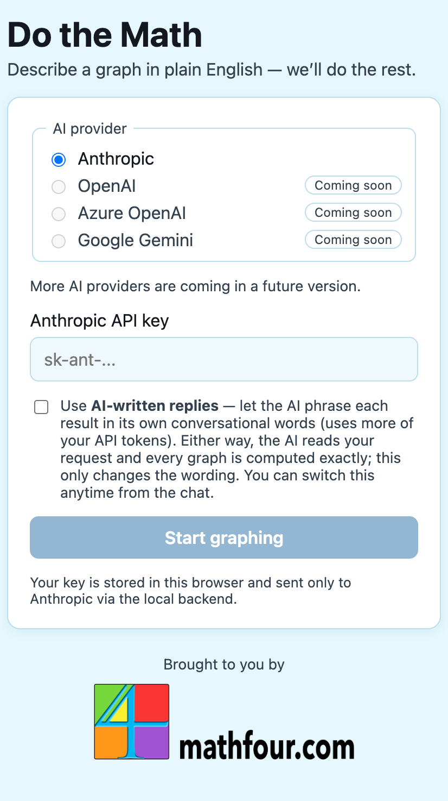
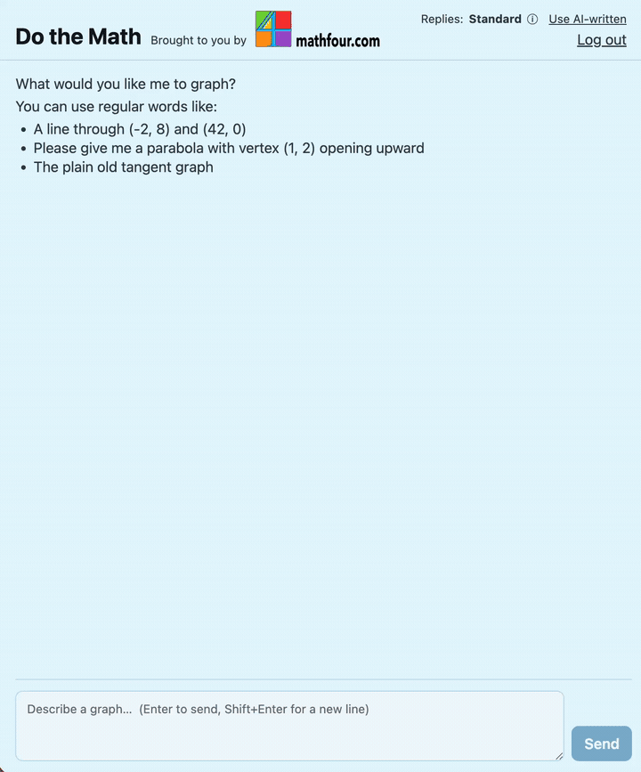

# Do the Math

A natural-language math agent. Describe what you want in plain English and Do the Math figures out the rest — starting with 2D graphing, and built from day one to grow into a full ecosystem of math agents (solving, factoring, calculus, proofs, and more).

> 🚧 **Status: in active development — v1.** The graphing vertical slice works end to end (see the [Demo](#demo) below). This README is a living document and grows as the build progresses. The full, frozen build spec lives in [SPEC.md](SPEC.md); build decisions and progress are tracked in [NOTES.md](NOTES.md).

### 👉 Just want to run it? Jump to **[Running locally](#running-locally)**.

---

## What it does

**v1 — Graphing.** Tell it what you want and it derives the equation and renders an interactive 2D plot.

> "I need a parabola with the vertex at (1, 2), opening upward."

Do the Math interprets the request into a structured **Math Intent**, validates the math with SymPy, derives the equation, and returns the graph.

**Where it's going — an ecosystem of agents.** The backend classifies *what kind* of math request came in (graphing? solving? a proof?) and dispatches it to the appropriate registered agent. Every agent shares the same math-understanding layer rather than re-parsing English on its own. The graphing agent is the first; the architecture lets new agents register and plug in without changing the orchestrator.

---

## The core idea: the Math Intent layer

Do the Math never goes straight from English to an equation. It always passes through a structured intermediate representation — the **Math Intent (IR)**:

```
English  ──►  Math Intent (IR)  ──►  validated math  ──►  output
```

The LLM's job is to produce the IR — a structured description of what the user wants. It is **not** the source of mathematical truth. A deterministic math engine (SymPy) validates and derives from the IR. The LLM does language understanding (what it's good at); SymPy keeps the math correct (what it's good at).

> "Graph a parabola with vertex (1,2) opening upward."

The LLM produces the IR:

```json
{ "kind": "parabola_vertex_direction", "vertex": [1, 2], "direction": "up" }
```

SymPy derives and validates:

```json
{ "equation": "y = (x - 1)**2 + 2" }
```

Why it matters: every future agent (Solver, Factoring, Calculus, Proof) consumes the **same** IR and reuses the **same** math engine. Adding an agent is mostly defining how it acts on an IR it already understands — not reinventing English-parsing and math handling.

### Shared components (built once, reused everywhere)

- `math_interpreter` — English → Math Intent (IR). LLM-backed, provider-agnostic.
- `math_engine` — IR → validated equations/results. SymPy-backed. The source of mathematical truth.
- `graph_renderer` — validated math → Plotly figure spec.

---

## Architecture

```
User (browser chat UI)
        │  React + TypeScript front end
        ▼
   Python backend (FastAPI)  ──►  Router / classifier
                                        │
                        ┌───────────────┼───────────────┐
                        ▼               ▼               ▼
                  Graphing agent   Solver agent     Proof agent
                  (v1, built)      (roadmap)        (roadmap)
                        │
                        ▼
              math_interpreter → math_engine (SymPy) → graph_renderer
                        │
                        ▼
              Provider adapter layer
              (Anthropic implemented; OpenAI/Azure/Gemini = roadmap)
                        │
                        ▼
              Model API (your own Anthropic key in v1)
```

- **Agents register themselves** behind a common interface (`can_handle(intent)` / `execute(request)`); the router dispatches to the match without per-agent special-casing.
- **Every agent returns the same output envelope**, so the front end renders results uniformly and future agents follow the same shape:

```json
{
  "type": "graph | solution | proof | clarification | error",
  "payload": { },
  "explanation": "human-readable summary of what was done"
}
```

- **Underspecified requests ask rather than guess.** Each IR object type has required fields; if one is missing, the agent returns a `clarification` question (e.g. "Where is the vertex?") instead of inventing an answer. This is deterministic — completeness of the required IR fields, not an LLM confidence score.

---

## What's graphable in v1

Functions of the form `y = f(x)`:

**Supported** — linear, quadratic, polynomial, trigonometric (sin/cos/tan), exponential, logarithmic.

**Out of scope for v1** — circles and other implicit equations (e.g. `x² + y² = 25`), parametric curves, polar graphs, piecewise functions, inequalities / shaded regions. For these, the app responds with a friendly, plain-language note explaining it can only graph `y = f(x)` right now and pointing you to what it *can* do — never a wrong graph. Ask it "what can I graph?" and it'll tell you.

---

## AI providers

v1 is **Anthropic-only**, end to end. The provider adapter interface is built so additional providers are pure additions later. On first run you'll see a provider/key screen listing Anthropic (active) plus OpenAI, Azure OpenAI, and Google Gemini (shown as "Coming soon"). You supply your own **Anthropic API key**; it's stored locally and never sent anywhere except Anthropic.

---

## The interface

A simple browser chat:

1. **First-run key screen** — pick a provider (Anthropic in v1) and paste your Anthropic key. It's saved in your browser only.
2. **Chat** — type a request in plain English; the graph comes back inline.
3. **Reasoning panel** — each result shows its work: the **Math Intent (IR)** the model produced and the **equation SymPy derived** from it, so you can see the architecture in motion rather than just input → graph.

---

## Demo




Full slice in motion — request → IR → SymPy derivation → graph:



> Artifacts are captured by the author with the app running. See [demo/README.md](demo/README.md) for the capture guide and recommended prompts.

---

## Running locally

1. **Get the prerequisites**
    * [uv](https://docs.astral.sh/uv/) (manages Python)
    * [Node.js](https://nodejs.org/) 20.19+ / 22.12+
    * [git](https://git-scm.com/)
    * [An Anthropic API key](https://console.anthropic.com/)


    <details>
    <summary>Do you need more help with these pre-requisites?</summary>

    1. Open a terminal on your computer

        <details>
        <summary>macOS / Linux</summary>
        On a Mac, press Command + Space, type "terminal", and press Enter. On most Linux desktops, press Ctrl + Alt + T, or open your applications and search for "Terminal".
        </details>

        <details>
        <summary>Windows (PowerShell)</summary>
        Press the Windows key, type "PowerShell", and click Windows PowerShell.
        </details>

    2. Install uv (this also manages Python for you)
        <details>
        <summary>macOS / Linux</summary>
        First install Homebrew — a package manager we'll use for this and the next couple of steps. Copy and paste this into your terminal and hit enter (it may ask for your computer password, and can take a few minutes):

        ```bash
        /bin/bash -c "$(curl -fsSL https://raw.githubusercontent.com/Homebrew/install/HEAD/install.sh)"
        ```

        Then install uv. Copy and paste this into your terminal and hit enter:

        ```bash
        brew install uv
        ```

        </details>

        <details>
        <summary>Windows (PowerShell)</summary>

        Copy and paste this into your terminal and hit enter:

        ```bash
        irm https://astral.sh/uv/install.ps1 | iex
        ```
        </details>

    3. Install Node.js

        <details>
        <summary>macOS / Linux</summary>

        Copy and paste this into your terminal and hit enter:

        ```bash
        brew install node
        ```
        </details>

        <details>
        <summary>Windows (PowerShell)</summary>

        Copy and paste this into your terminal and hit enter:

        ```bash
        winget install OpenJS.NodeJS.LTS
        ```
        </details>

    4. Install git

        <details>
        <summary>macOS / Linux</summary>

        If you're running a Mac, you might already have this, but it won't hurt to do this. Copy and paste this into your terminal and hit enter:

        ```bash
        brew install git
        ```
        </details>

        <details>
        <summary>Windows (PowerShell)</summary>

        Copy and paste this into your terminal and hit enter:

        ```bash
        winget install Git.Git
        ```
        </details>

    5. Confirm everything's installed

        Copy and paste each of these into your terminal and hit enter. They should each print a version. If they give you `command not found` you might have to go back and redo a step.

        ```bash
        uv --version
        ```
        ```bash
        node --version
        ```
        ```bash
        git --version
        ```

    6. Get an Anthropic API key
        1. Sign in at [console.anthropic.com](https://console.anthropic.com/)
        2. If your "credit balance" is zero, click on add funds and add $5 of credits. (Be careful---after you add credits, it will prompt you to automatically add credits when you go low. A safe bet is to click "Skip for now".) The API is pay-as-you-go from a prepaid balance and seems to be about $0.01 per graph. For $5, you should get at least 500 graphs (btw, that's math!).
        3. Click "Get API key".
        4. Name your API key and click "Create API key" (it will start with `sk-ant-`).
        5. Copy and paste this someplace safe. The first time you run this, you'll need paste it in. Your browser will offer to store it in your password manager for secure autofill (which you don't HAVE to do, but you can---it's as secure as any other saved password you have).

    </details>


2. **Clone the repo**

    Copy and paste this into your terminal and hit enter:

    ```bash
    git clone https://github.com/mathfour/do-the-math.git
    ```

3. **Run it**

    Copy and paste each of these into your terminal and hit enter:

    ```bash
    cd do-the-math
    ```

    ```bash
    ./run.sh
    ```

This installs dependencies for both halves, starts the backend (port 8000) and the frontend, and opens the app in your browser.

On first run, choose **Anthropic** and paste your API key (see the prerequisites above for how to get one). It's saved in your browser, so you stay signed in next time — and sent only to Anthropic, via the local backend.

Press **Ctrl+C** to stop.

<details>
<summary>Prefer to run the two halves yourself?</summary>

```bash
# Terminal 1 — backend (http://localhost:8000)
cd backend && uv sync && uv run uvicorn app.main:app --port 8000

# Terminal 2 — frontend (http://localhost:5173)
cd frontend && npm install && npm run dev
```

</details>

---

## Roadmap

- [x] Graphing agent (2D) on the shared math core — **Anthropic, v1**
- [ ] Remaining provider adapters (OpenAI, Azure OpenAI, Gemini)
- [ ] Router/classifier hardening as agents are added
- [ ] Equation solver agent
- [ ] Theorem / proof agent

### Planned agents (all reuse `math_interpreter` + `math_engine`)

Solver · Simplification · Factoring · Calculus · Geometry · Statistics · Proof

---

## Project docs

- **[SPEC.md](SPEC.md)** — the frozen v1 build spec and acceptance checklist (the original planning document; the source of truth for what we agreed to build).
- **[NOTES.md](NOTES.md)** — the living dev log: decisions and their rationale, deviations from the spec, phase status, and review notes.
- **[CLARICE.md](CLARICE.md)** — the reviewer's phase-by-phase verdicts and follow-ups.
